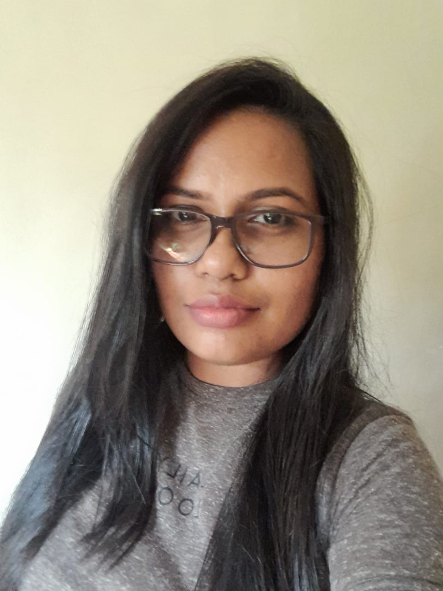

# Welcome to my Website

I’m Dushani Munasinghe, a Lecturer in Electronics and Telecommunication Engineering at the Department of Electrical & Electronics Engineering, Faculty of Engineering & Technology, CINEC Campus, Sri Lanka.

With a strong academic background, I am passionate about guiding engineering undergraduates to excel in the dynamic fields of electronics and telecommunications. My journey in academia has been enriched by diverse teaching experiences at different institutions teaching B.Sc. Engineering undergraduate students, engaging in research, supervising final year projects, coordinating programs and more. 

# My Teaching Philosophy

In today's digital era, where information is readily available at the click of a button, the role of the teacher has not diminished—it has evolved. While students can access vast resources online, they often need guidance to understand how theories can be applied to real-world scenarios. I view my role as a facilitator who transforms abstract facts into practical, multifaceted insights. My goal is to help students develop a broader perspective that enables them to see beyond the surface of the information they encounter.

I also believe that a teacher serves as a role model, influencing not only the academic growth of students but also their development as individuals. Students naturally absorb and emulate the qualities of their mentors, so I strive to exemplify integrity, ethical conduct, and a passion for lifelong learning. By modeling these values, I aim to foster an environment where students cultivate both technical expertise and strong personal competencies.

Recognizing the financial privilege often enjoyed by students in non-state universities, I see this as an opportunity rather than a limitation. I encourage my students to leverage their resources to drive innovation and create solutions that are not only technically sound but also marketable. I emphasize the importance of using these advantages to push the boundaries of performance and finish, aligning academic endeavors with the dynamic needs of the industry.

Furthermore, I believe that engineering education should extend beyond solving complex problems. It is essential for graduates to adopt a futuristic viewpoint, considering the broader environmental impacts of their work. Engineers should be equipped not only with the technical skills required for their profession but also with a responsibility toward sustainability and the welfare of all living beings.

Through this teaching philosophy, I aim to nurture well-rounded engineers who are innovative, ethically grounded, and prepared to meet the challenges of tomorrow—making meaningful contributions to society and the environment.

